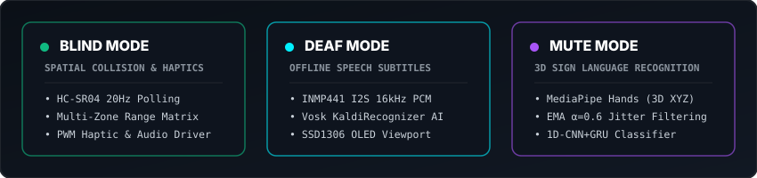

<div align="center">



[](https://git.io/typing-svg)

<br />

[](https://www.python.org/)
[](https://pytorch.org/)
[](https://ai.google.dev/edge/mediapipe/solutions/guide)
[](https://alphacephei.com/vosk/)
[](https://www.raspberrypi.com/)
[](LICENSE)

---

</div>

## Overview

**TriSense** is an open-source, edge-embedded Linux multi-modal sensory augmentation platform designed for **Raspberry Pi 4**. It combines real-time spatial ultrasonic sensing, offline speech-to-text transcription, and 3D sign language recognition into a unified, modular, low-latency assistive hardware-software ecosystem.

Unlike traditional assistive technologies that rely on cloud APIs or isolated single-function microcontrollers, TriSense operates entirely **at the edge** with zero internet dependency, utilizing shared hardware resources orchestrated by a thread-safe, priority-scheduling mode manager.

---

## Sensory Augmentation Architecture

<div align="center">
  
</div>

<br />

<div align="center">
  
</div>

---

## Core Sensory Pipelines

### 1. Blind Mode — Spatial Collision & Haptics Engine
* **Hardware Interface:** HC-SR04 Ultrasonic Distance Sensor array (3 sensors: left, center, right) + NPN-transistor-driven Haptic Vibration Motors & Piezo Audio Alert.
* **Algorithm:** 10Hz polling loop (100ms interval) mapping spatial distance into linear-mapped vibration pulse intensities and variable audible warning frequencies.
* **Dynamic Range Zones:** Implements multi-threshold collision detection (`SAFE`, `WARN`, `CRITICAL`) with pre-emptive jitter damping and zero-latency haptic feedback.

### 2. Deaf Mode — Offline Speech Subtitle Viewport
* **Hardware Interface:** INMP441 I2S Digital Microphone (16 kHz, 16-bit Mono PCM) + SSD1306 128×64 I2C OLED Display.
* **ASR Engine:** Offline Kaldi-based **Vosk** speech recognition (`vosk-model-small-en-us`) supporting streaming partial transcriptions and word-boundary detection.
* **Viewport Formatter:** Automatic punctuation and capitalization, 20-character line wrapping, ellipsis (`...`) overflow indication, and 3-line rolling subtitle display history.

### 3. Mute Mode — 3D Sign Language Recognition Pipeline
* **Landmark Extractor:** Real-time 3D hand tracking via **MediaPipe Hands** (`HandLandmarker`), extracting 21 $(X, Y, Z)$ spatial keypoints per hand normalized relative to wrist origin and bounding scale.
* **Temporal Smoothing & Buffer:** Exponential Moving Average (EMA, $\alpha=0.6$) coordinate jitter suppression combined with a 30-frame rolling FIFO sequence buffer (`GestureSequenceBuffer`) and hold-last-good-value occlusion imputation.
* **Edge Neural Classifier:** Lightweight **1D-CNN + GRU** hybrid classifier (`SignLanguageClassifier`, **68,324 trainable parameters**) for **100-word** American Sign Language (ASL) vocabulary classification (trained on the WLASL dataset).

### 4. Mode Manager — Resource Orchestration
* **Software Core:** Thread-safe supervisor (`shared/mode_manager.py`) governing mutually exclusive access to shared peripheral resources (Camera, Audio I2S/Speaker, OLED I2C).
* **Hardware Interrupts:** GPIO button interrupt trigger (with keyboard input simulation for local desktop development) for seamless mode switching.

---

## Hardware Bill of Materials (BOM) & Pinout

| Peripheral | Controller / Protocol | Raspberry Pi 4 GPIO Pin | Function / Description |
| :--- | :--- | :--- | :--- |
| **HC-SR04 Left** | GPIO TTL | `GPIO 5` (Trig), `GPIO 6` (Echo) | Left spatial distance sensor (~30° left of center) |
| **HC-SR04 Center** | GPIO TTL | `GPIO 13` (Trig), `GPIO 16` (Echo) | Center spatial distance sensor (straight ahead) |
| **HC-SR04 Right** | GPIO TTL | `GPIO 26` (Trig), `GPIO 17` (Echo) | Right spatial distance sensor (~30° right of center) |
| **Haptic Motor Left** | GPIO (NPN transistor) | `GPIO 23` | Left tactile vibration alert |
| **Haptic Motor Center** | GPIO (NPN transistor) | `GPIO 24` | Center tactile vibration alert |
| **Haptic Motor Right** | GPIO (NPN transistor) | `GPIO 25` | Right tactile vibration alert |
| **INMP441 I2S Mic** | I2S Digital Audio | `GPIO 18` (CLK), `GPIO 19` (WS), `GPIO 20` (SD) | 16 kHz 16-bit Mono PCM digital input |
| **MAX98357A I2S Amp** | I2S Digital Audio | `GPIO 18` (BCLK), `GPIO 19` (LRC), `GPIO 21` (DIN) | I2S speaker amplifier for TTS output |
| **SSD1306 OLED** | I2C (`0x3C`) | `GPIO 2` (SDA), `GPIO 3` (SCL) | 128×64 subtitle & status display |
| **Raspberry Pi Camera V2** | CSI / USB Video | `CAM / USB 2.0` | Real-time video stream for MediaPipe |

> For complete hardware wiring, I2S overlay configuration (`/boot/config.txt`), and acoustic calibration steps, see [`blind_mode/HARDWARE_TODO.md`](blind_mode/HARDWARE_TODO.md) and [`deaf_mode/HARDWARE_TODO.md`](deaf_mode/HARDWARE_TODO.md).

---

## Quick Start & Verification Suite

### 1. Local Environment Setup
```bash
# Clone the repository
git clone https://github.com/Ryzuuuu/TriSense.git
cd TriSense

# Create and activate Python 3.12+ virtual environment
python -m venv venv
# On Linux/macOS:
source venv/bin/activate
# On Windows PowerShell:
.\venv\Scripts\Activate.ps1

# Install project dependencies
pip install --upgrade pip
pip install -r requirements.txt
```

### 2. Run Modular Verification Suites
Each sensory module includes an automated verification test suite that executes locally without requiring physical Raspberry Pi GPIO peripherals:

```bash
# Verify Blind Mode (Ultrasonic Math, Closing Speed & Haptic Intensity)
python blind_mode/synthetic_test.py

# Verify Deaf Mode (16kHz PCM Stream, Vosk ASR, Caption Formatter, OLED Renderer)
python deaf_mode/test_audio_stream.py
python deaf_mode/test_asr_engine.py
python deaf_mode/test_caption_formatter.py
python deaf_mode/test_caption_renderer.py
python deaf_mode/test_oled_display.py
python deaf_mode/test_main_loop.py

# Verify Mute Mode (3D Landmark Extraction, EMA Jitter Filter, & 1D-CNN+GRU Classifier)
python mute_mode/test_landmark_extractor.py
python mute_mode/test_sequence_buffer.py
python mute_mode/test_classifier_pipeline.py
python mute_mode/test_dataset_downloader.py

# Verify Mode Manager (Resource Locking & State Transitions)
python shared/test_mode_manager.py
```

---

## Repository Structure

```
TriSense/
├── blind_mode/                # Spatial Collision & Haptic Feedback Pipeline
│   ├── sensor_loop.py         # 10Hz ultrasonic sensor polling & alert loop
│   ├── haptic.py              # Haptic pulse intensity mapping
│   ├── collision.py           # Closing speed & time-to-collision computation
│   ├── distance.py            # HC-SR04 raw sensor read with echo timeout
│   ├── audio_alert.py         # Non-blocking pyttsx3 TTS alert worker
│   ├── gpio_setup.py          # BCM pin initialisation & cleanup
│   ├── synthetic_test.py      # Synthetic sensor value automated test suite
│   ├── test_logger.py         # Live sensor read & CSV logging utility
│   └── HARDWARE_TODO.md       # Hardware wiring & GPIO deployment checklist
├── deaf_mode/                 # Offline Speech-to-Text OLED Subtitle Pipeline
│   ├── audio_stream.py        # 16kHz I2S / WAV PCM block streamer
│   ├── asr_engine.py          # Vosk offline Kaldi speech recognition
│   ├── caption_formatter.py   # Punctuation, capitalization, and line-wrapping
│   ├── caption_renderer.py    # OLED subtitle rendering coordinator
│   ├── oled_display.py        # SSD1306 I2C OLED viewport driver
│   ├── main_loop.py           # End-to-end Deaf mode main event loop
│   ├── test_asr_engine.py     # ASR engine automated test suite
│   ├── test_audio_stream.py   # Audio stream automated test suite
│   ├── test_caption_formatter.py  # Caption formatter automated test suite
│   ├── test_caption_renderer.py   # Caption renderer automated test suite
│   ├── test_main_loop.py      # End-to-end Deaf mode automated test suite
│   ├── test_oled_display.py   # OLED display automated test suite
│   └── HARDWARE_TODO.md       # I2S INMP441 & I2C SSD1306 setup guide
├── mute_mode/                 # 3D Sign Language Recognition Pipeline
│   ├── landmark_extractor.py  # MediaPipe Hands 21 (X, Y, Z) keypoint extractor
│   ├── sequence_buffer.py     # EMA temporal smoother & 30-frame FIFO buffer
│   ├── classifier.py          # 1D-CNN + GRU edge PyTorch classifier (~62.6k params)
│   ├── train_classifier.py    # Training script & load_checkpoint utility
│   ├── dataset_downloader.py  # WLASL bulk video fetch & landmark dataset builder
│   ├── video_stream.py        # Camera & video file input streamer
│   ├── test_landmark_extractor.py  # Landmark extraction test suite
│   ├── test_sequence_buffer.py     # Sequence buffer test suite
│   ├── test_classifier_pipeline.py # Classifier architecture & smoke test suite
│   └── test_dataset_downloader.py  # Dataset downloader test suite
├── shared/                    # Common System Resources
│   ├── mode_manager.py        # Thread-safe multi-mode resource orchestrator
│   └── test_mode_manager.py   # Mode manager & resource locking test suite
├── assets/                    # Animated SVG architecture & banner graphics
├── PROGRESS.md                # Living development roadmap & verification tracker
└── README.md                  # Project engineering documentation
```

---

## Roadmap

- [x] **Phase 1A**: Blind Mode Software Pipeline & Haptic Mapping
- [x] **Phase 1B**: Deaf Mode Offline ASR Engine & OLED Subtitle Formatter
- [x] **Phase 1C**: Mute Mode — 100-word ASL Vocabulary (WLASL), 734 real training samples, 33.33% validation accuracy, fully integrated under ModeManager
- [x] **Phase 1D**: Mode Manager Resource Locking & Orchestration
- [ ] **Phase 2**: Model Quantization (ONNX / TFLite INT8 Export) & Edge Latency Profiling
- [ ] **Phase 3**: Physical Raspberry Pi 4 GPIO Deployment & Field Validation

---

<div align="center">
  <p><b>TriSense</b> — Designed and Engineered for Linux Edge Computing</p>
</div>
