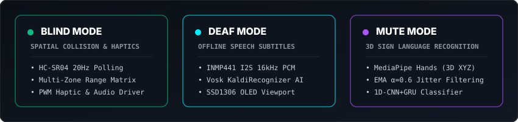

<div align="center">



[](https://git.io/typing-svg)

<br />

[](https://github.com/Ryzuuuu/TriSense/actions/workflows/ci.yml)
[](https://www.python.org/)
[](https://pytorch.org/)
[](https://ai.google.dev/edge/mediapipe/solutions/guide)
[](https://alphacephei.com/vosk/)
[](https://www.raspberrypi.com/)
[](LICENSE)

---

</div>

## Overview

**TriSense** is a wearable, edge-embedded assistive platform for the **Raspberry Pi 4**. One device offers three switchable accessibility modes for people with visual, hearing or speech impairments:

| Mode | Who it helps | What it does |
| :--- | :--- | :--- |
| **Blind** | Visual impairment | Three ultrasonic sensors (left / center / right) measure obstacle distance and closing speed; haptic motors pulse by urgency and the device speaks a warning for obstacles dead ahead. |
| **Deaf** | Hearing impairment | A microphone feeds an offline speech recogniser; live captions are formatted and shown on a small OLED. |
| **Mute** | Speech impairment | A camera feeds a hand-landmark tracker and a sequence classifier that recognises ASL signs and speaks them aloud. |

Everything runs **on the device with no internet connection** (cloud APIs are never used at runtime). A thread-safe **Mode Manager** guarantees that only one mode owns the shared peripherals (camera, microphone, speaker, OLED, GPIO) at a time.

The whole stack also runs on a laptop: a bundled mock `RPi.GPIO`, WAV/video file inputs and an ASCII OLED let you develop and test without any hardware, and a browser-based **emulator** visualises all three modes.

---

## Features

- **Blind Mode** - 3-sensor HC-SR04 polling at 10 Hz, closing-speed and time-to-collision estimation, tiered haptic pulses (150 / 300 / 500 ms) and a spoken "Obstacle ahead" alert, with echo time-outs so a dead sensor can never stall the loop.
- **Deaf Mode** - 16 kHz mono PCM streaming, offline Vosk recognition with partial and final results, caption formatter (capitalisation, punctuation, 20-character wrapping, "..." overflow marker) and a 3-line rolling SSD1306 OLED viewport.
- **Mute Mode** - MediaPipe 21-point 3D hand landmarks normalised to the wrist, EMA smoothing with occlusion imputation, a 30-frame sequence buffer and a 68,324-parameter 1D-CNN + GRU classifier over a 100-word ASL vocabulary (WLASL).
- **Mode Manager** - exclusive resource locking (`SPEAKER`, `CAMERA`, `MICROPHONE`, `DISPLAY`, `GPIO_SENSORS`, `GPIO_MOTORS`), clean transitions that stop the old pipeline before the new one starts, and a keyboard trigger standing in for the planned GPIO mode button.
- **Shared TTS** - one text-to-speech worker owned by the Mode Manager, with per-alert cool-downs; degrades to console logging when no speech backend is installed.
- **Web emulator** - Flask + Socket.IO dashboard showing live captions, per-sensor haptic pulses, sign predictions and which mode currently owns each resource.
- **Tests** - fast hardware-free pytest suite plus per-module verification scripts (see [Testing](#testing)); CI runs lint and the unit tests on every push.

---

## Architecture

<div align="center">
  
</div>

<br />

<div align="center">
  
</div>

The Mode Manager adapts each pipeline behind a common `start()` / `stop()` interface and declares which resources it needs:

| Mode | Resources acquired | Data flow |
| :--- | :--- | :--- |
| `BLIND` | `SPEAKER`, `GPIO_SENSORS`, `GPIO_MOTORS` | HC-SR04 x3 -> distance -> closing speed -> time-to-collision -> haptic pulse / spoken alert |
| `DEAF` | `MICROPHONE`, `DISPLAY` | mic / WAV -> Vosk ASR -> caption formatter -> OLED renderer |
| `MUTE` | `CAMERA`, `SPEAKER` | camera / video -> MediaPipe landmarks -> EMA smoother -> 30-frame buffer -> CNN+GRU -> TTS |

Requesting a mode whose resources are held by another mode raises `ResourceLockError`; `switch_mode()` always tears down the running pipeline first, and a pipeline that fails to start leaves the system in `IDLE` with every resource released.

---

## Core Sensory Pipelines

### 1. Blind Mode - Spatial Collision & Haptics
* **Hardware:** three HC-SR04 ultrasonic sensors, three NPN-driven vibration motors, and a speaker for spoken alerts.
* **Algorithm:** every 100 ms each sensor is read, the closing speed `(d_prev - d_now) / dt` and time-to-collision `d / speed` are computed, and the TTC selects the haptic pulse: `< 1.5 s` -> 150 ms, `< 1.0 s` -> 300 ms, `< 0.5 s` -> 500 ms. A centre TTC below 1.0 s additionally speaks "Obstacle ahead".
* **Robustness:** every echo wait is time-limited (30 ms); a timed-out reading becomes `None` and is ignored by the collision maths.

### 2. Deaf Mode - Offline Speech Subtitles
* **Hardware:** INMP441 I2S digital microphone (16 kHz, 16-bit mono PCM) and an SSD1306 128x64 I2C OLED.
* **ASR:** Kaldi-based **Vosk** (`vosk-model-small-en-us`) with streaming partial results and utterance endpointing.
* **Viewport:** automatic capitalisation and punctuation, 20-character word-safe wrapping, a leading `...` when older text scrolls off, and a 3-line rolling history.

### 3. Mute Mode - Sign Language Recognition
* **Landmarks:** MediaPipe `HandLandmarker` extracts 21 (X, Y, Z) keypoints per hand, translated to the wrist origin and scaled by hand size.
* **Temporal handling:** EMA smoothing (alpha = 0.6) with hold-last-good-value occlusion imputation, feeding a 30-frame FIFO `GestureSequenceBuffer`.
* **Classifier:** `SignLanguageClassifier` - a 1D-CNN + GRU hybrid with **68,324 trainable parameters** over a **100-word** ASL vocabulary trained on [WLASL](https://github.com/dxli94/WLASL) clips (see [`mute_mode/DATASET_SOURCE.md`](mute_mode/DATASET_SOURCE.md)).

### 4. Mode Manager - Resource Orchestration
* **Core:** `shared/mode_manager.py` - `ResourceGuard` (single-owner locks) and `ModeManager` (transitions, error recovery, shared TTS lifecycle).
* **Trigger:** `handle_key_input()` maps `1` / `2` / `3` to Blind / Deaf / Mute and `0` / `q` to idle - a desktop stand-in for the physical GPIO button planned for the Pi.

---

## Tech Stack

| Area | Technology |
| :--- | :--- |
| Language | Python 3.11+ |
| Sign recognition | PyTorch (1D-CNN + GRU), MediaPipe Tasks `HandLandmarker`, OpenCV, NumPy |
| Speech recognition | Vosk / Kaldi (offline), `sounddevice` |
| Speech output | `pyttsx3` (offline TTS) |
| Display & hardware | `luma.oled` + Pillow (SSD1306), `RPi.GPIO` (mocked on PCs) |
| Emulator | Flask, Flask-SocketIO |
| Quality | pytest, Ruff, GitHub Actions |

---

## Hardware Bill of Materials (BOM) & Pinout

| Peripheral | Controller / Protocol | Raspberry Pi 4 GPIO Pin | Function / Description |
| :--- | :--- | :--- | :--- |
| **HC-SR04 Left** | GPIO TTL | `GPIO 5` (Trig), `GPIO 6` (Echo) | Left spatial distance sensor (~30° left of center) |
| **HC-SR04 Center** | GPIO TTL | `GPIO 13` (Trig), `GPIO 16` (Echo) | Center spatial distance sensor (straight ahead) |
| **HC-SR04 Right** | GPIO TTL | `GPIO 26` (Trig), `GPIO 17` (Echo) | Right spatial distance sensor (~30° right of center) |
| **Haptic Motor Left** | GPIO (NPN transistor) | `GPIO 23` | Left tactile vibration alert |
| **Haptic Motor Center** | GPIO (NPN transistor) | `GPIO 24` | Center tactile vibration alert |
| **Haptic Motor Right** | GPIO (NPN transistor) | `GPIO 25` | Right tactile vibration alert |
| **INMP441 I2S Mic** | I2S Digital Audio | `GPIO 18` (CLK), `GPIO 19` (WS), `GPIO 20` (SD) | 16 kHz 16-bit Mono PCM digital input |
| **MAX98357A I2S Amp** | I2S Digital Audio | `GPIO 18` (BCLK), `GPIO 19` (LRC), `GPIO 21` (DIN) | I2S speaker amplifier for TTS output |
| **SSD1306 OLED** | I2C (`0x3C`) | `GPIO 2` (SDA), `GPIO 3` (SCL) | 128x64 subtitle & status display |
| **Raspberry Pi Camera V2** | CSI / USB Video | `CAM / USB 2.0` | Real-time video stream for MediaPipe |

> For complete hardware wiring, I2S overlay configuration (`/boot/config.txt`), and acoustic calibration steps, see [`blind_mode/HARDWARE_TODO.md`](blind_mode/HARDWARE_TODO.md) and [`deaf_mode/HARDWARE_TODO.md`](deaf_mode/HARDWARE_TODO.md).

---

## Getting Started

### 1. Install

```bash
git clone https://github.com/Ryzuuuu/TriSense.git
cd TriSense

python -m venv venv
source venv/bin/activate          # Linux / macOS
# .\venv\Scripts\Activate.ps1     # Windows PowerShell

pip install --upgrade pip
pip install -r requirements.txt   # use requirements-dev.txt to also get pytest + ruff
```

On the Raspberry Pi also run `pip install RPi.GPIO luma.oled`. On a PC the bundled mock `RPi.GPIO` is picked up automatically.

### 2. Models & sample data

Large or downloadable files are **not stored in git** (see `.gitignore`). Run the helpers from the repository root:

| File | Needed for | How to get it |
| :--- | :--- | :--- |
| `models/vosk-model-small-en-us/` (~40 MB) | Real Deaf Mode recognition | `python deaf_mode/download_model.py` |
| `mute_mode/models/hand_landmarker.task` | Mute Mode landmarks | downloaded automatically on first use |
| `deaf_mode/real_speech.wav` | Deaf Mode demo / emulator input | `python deaf_mode/get_real_speech_sample.py` |
| `mute_mode/real_sign.mp4` | Mute Mode mock camera (tests, emulator) | any short clip of a signing hand saved at this path |

Without the Vosk model the ASR engine falls back to a mock recogniser, and without the WAV the Deaf Mode input is silence, so the unit tests and the rest of the system still run. The trained classifier (`mute_mode/checkpoints/`) and the extracted landmark dataset (`mute_mode/dataset/`) are included.

---

## Usage

### Web emulator

```bash
python emulator_server.py
```

Open <http://127.0.0.1:5000>. Use the mode buttons to switch between Blind, Deaf and Mute; the dashboard shows live haptic pulses, OLED captions, sign predictions and the current `ResourceGuard` owners. Set `MOCK_DISTANCE` to a number of centimetres (or `RANDOM`) before starting to change what the simulated ultrasonic sensors report. The page loads the Socket.IO client from a CDN, so the browser needs internet access.

### Mode Manager from Python

```python
from shared.mode_manager import ModeManager

manager = ModeManager()
manager.switch_mode("BLIND")                                   # ultrasonic + haptics (mock GPIO on a PC)
manager.switch_mode("DEAF", wav_path="deaf_mode/real_speech.wav", use_mock=True)
manager.switch_mode("MUTE", use_mock=True)                     # classify the mock video stream
manager.handle_key_input("0")                                  # back to IDLE (same as switch_mode("IDLE"))
manager.shutdown()                                             # stop the active pipeline and the TTS worker
```

### Retraining the sign classifier

```bash
python mute_mode/dataset_downloader.py     # fetch more WLASL clips and extract (30, 126) landmark tensors
python mute_mode/train_classifier.py       # train and write mute_mode/checkpoints/real_model.pth
```

---

## Testing

```bash
# Fast, hardware-free unit tests (also run in CI)
pip install -r requirements-dev.txt
pytest
ruff check .
```

Each subsystem also ships an end-to-end verification script that exercises the real components (models, video and WAV files) with mock hardware. Run them from the repository root:

```bash
python blind_mode/synthetic_test.py            # ultrasonic maths, closing speed, haptic intensity
python deaf_mode/test_audio_stream.py          # 16 kHz PCM streaming
python deaf_mode/test_asr_engine.py            # Vosk (needs the model, see above)
python deaf_mode/test_caption_formatter.py
python deaf_mode/test_caption_renderer.py
python deaf_mode/test_oled_display.py
python deaf_mode/test_main_loop.py             # end-to-end Deaf Mode
python mute_mode/test_landmark_extractor.py    # needs mute_mode/real_sign.mp4
python mute_mode/test_sequence_buffer.py       # needs mute_mode/real_sign.mp4
python mute_mode/test_classifier_pipeline.py
python mute_mode/test_dataset_downloader.py
python shared/test_mode_manager.py             # resource locking and mode transitions (slow: loads PyTorch and MediaPipe)
```

---

## Repository Structure

```
TriSense/
├── blind_mode/                # Spatial Collision & Haptic Feedback Pipeline
│   ├── sensor_loop.py         # 10Hz ultrasonic sensor polling & alert loop
│   ├── distance.py            # HC-SR04 raw sensor read with echo timeout
│   ├── collision.py           # Closing speed & time-to-collision computation
│   ├── haptic.py              # TTC -> haptic pulse mapping and motor driver
│   ├── audio_alert.py         # Spoken-alert front end for the shared TTS worker
│   ├── gpio_setup.py          # BCM pin initialisation & cleanup
│   ├── config.py              # Pin map and timing constants
│   ├── mock_gpio.py           # Simulated HC-SR04 / GPIO behaviour (MOCK_DISTANCE)
│   ├── mock_lib/RPi/          # Drop-in RPi.GPIO shim used on non-Pi machines
│   ├── synthetic_test.py      # Synthetic sensor value automated test suite
│   ├── test_logger.py         # Live sensor read & CSV logging utility
│   └── HARDWARE_TODO.md       # Hardware wiring & GPIO deployment checklist
├── deaf_mode/                 # Offline Speech-to-Text OLED Subtitle Pipeline
│   ├── audio_stream.py        # 16kHz I2S / WAV PCM block streamer (+ mock_audio.py)
│   ├── asr_engine.py          # Vosk offline Kaldi speech recognition
│   ├── caption_formatter.py   # Punctuation, capitalization, and line-wrapping
│   ├── caption_renderer.py    # OLED subtitle rendering coordinator
│   ├── oled_display.py        # SSD1306 I2C OLED driver + ASCII mock
│   ├── main_loop.py           # End-to-end Deaf mode main event loop
│   ├── download_model.py      # Fetches the Vosk model into models/
│   ├── get_real_speech_sample.py / generate_real_speech_wav.py   # Sample audio helpers
│   ├── test_*.py              # Per-component verification scripts
│   └── HARDWARE_TODO.md       # I2S INMP441 & I2C SSD1306 setup guide
├── mute_mode/                 # 3D Sign Language Recognition Pipeline
│   ├── landmark_extractor.py  # MediaPipe Hands 21 (X, Y, Z) keypoint extractor
│   ├── sequence_buffer.py     # EMA temporal smoother & 30-frame FIFO buffer
│   ├── classifier.py          # 1D-CNN + GRU edge PyTorch classifier (~68.3k params)
│   ├── train_classifier.py    # Training script & load_checkpoint utility
│   ├── dataset_downloader.py  # WLASL bulk video fetch & landmark dataset builder
│   ├── video_stream.py        # Camera & video file input streamer (+ mock_video.py)
│   ├── checkpoints/           # Trained model weights
│   ├── dataset/               # Extracted (30, 126) landmark tensors per word
│   ├── test_*.py              # Per-component verification scripts
│   └── DATASET_SOURCE.md      # WLASL provenance and citation
├── shared/                    # Common System Resources
│   ├── mode_manager.py        # Thread-safe multi-mode resource orchestrator
│   ├── tts_output.py          # Central text-to-speech worker
│   └── test_mode_manager.py   # Mode manager & resource locking verification
├── tests/                     # Fast pytest unit tests (no hardware or models)
├── emulator_server.py         # Flask-SocketIO web emulator (serves templates/)
├── templates/index.html       # Emulator dashboard UI
├── docs/                      # Academic deliverables: Phase-1 report, Review-1 deck,
│                              # research paper, build notes, project write-up
├── assets/                    # Animated SVG architecture & banner graphics
├── requirements.txt           # Runtime / emulator dependencies
├── requirements-dev.txt       # + pytest and ruff
├── pyproject.toml             # pytest and ruff configuration
├── .github/workflows/ci.yml   # Lint + unit tests on push and pull request
├── PROGRESS.md                # Living development roadmap & verification tracker
└── TriSense_Build_Plan.md     # Original build plan
```

---

## Project Status & Limitations

- **Software complete on mock hardware** for all three modes plus the Mode Manager; **not yet deployed on a physical Raspberry Pi** (see the `HARDWARE_TODO.md` checklists).
- **Mute Mode accuracy is low and experimental:** 100 ASL words with ~734 real training clips (about 7 per word) reach **33.33 % validation accuracy**, and validation classes can have as few as one sample. Treat predictions as a proof of concept, not a usable translator.
- Deaf Mode uses the small English Vosk model; recognition quality depends heavily on microphone placement and noise.
- The emulator is a local development server (Werkzeug), not a production deployment.

---

## Roadmap

- [x] **Phase 1A**: Blind Mode Software Pipeline & Haptic Mapping
- [x] **Phase 1B**: Deaf Mode Offline ASR Engine & OLED Subtitle Formatter
- [x] **Phase 1C**: Mute Mode - 100-word ASL Vocabulary (WLASL), 734 real training samples, 33.33% validation accuracy, fully integrated under ModeManager
- [x] **Phase 1D**: Mode Manager Resource Locking & Orchestration
- [ ] **Phase 2**: Model Quantization (ONNX / TFLite INT8 Export) & Edge Latency Profiling
- [ ] **Phase 3**: Physical Raspberry Pi 4 GPIO Deployment & Field Validation

---

## License

Released under the [MIT License](LICENSE).

<div align="center">
  <p><b>TriSense</b> - Designed and Engineered for Linux Edge Computing</p>
</div>
